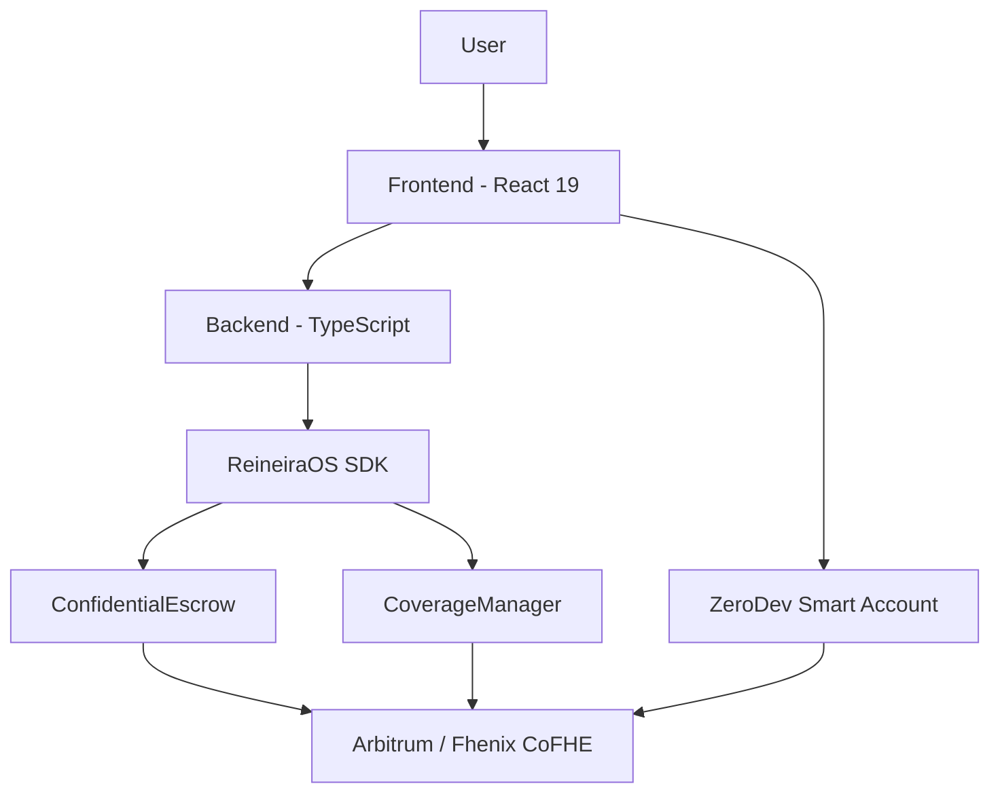

# Architecture — {venture_name}

## Ecosystem

| Repo                          | Stack                                          | Purpose                |
| ----------------------------- | ---------------------------------------------- | ---------------------- |
| reineira-atlas                | Markdown + Claude agents                       | Startup OS             |
| reineira-code                 | Hardhat + Solidity + cofhejs                   | Smart contracts        |
| platform-modules/backend      | TypeScript + Clean Architecture (Vercel-ready) | Backend API            |
| platform-modules/app          | React 19 + Vite + Zustand + TanStack Router + Tailwind + ZeroDev | Platform app           |

## Tech Stack

| Layer             | Technology                                      | Purpose                |
| ----------------- | ----------------------------------------------- | ---------------------- |
| Contracts         | Solidity ^0.8.24 + Hardhat + cofhejs            | Resolvers, policies    |
| Frontend          | React 19 + TypeScript + Vite + Zustand + TanStack Router + TailwindCSS | Platform app           |
| Backend           | TypeScript + Clean Architecture (DB-agnostic)   | API + business logic   |
| Wallet (primary)  | ZeroDev — ERC-4337 smart accounts, passkeys     | User operations        |
| Encryption        | Fhenix CoFHE                                    | On-chain FHE           |
| Settlement        | Stablecoin-agnostic (IFHERC20) + CCTP v2        | Any wrapped stablecoin |
| Deploy            | Hardhat (contracts), Vercel (apps)              | Infrastructure         |

## System Diagram



## Data Entities

| Entity       | Description              | Key Fields                            |
| ------------ | ------------------------ | ------------------------------------- |
| Escrow       | FHE-encrypted settlement | owner, amount, paidAmount, isRedeemed |
| {from brief} | {description}            | {fields}                              |

## Running Locally

```bash
# Backend
cd platform-modules/backend && npm run dev

# Frontend
cd platform-modules/app && yarn dev  # port 4831

# Contracts
cd reineira-code && npx hardhat test
```
